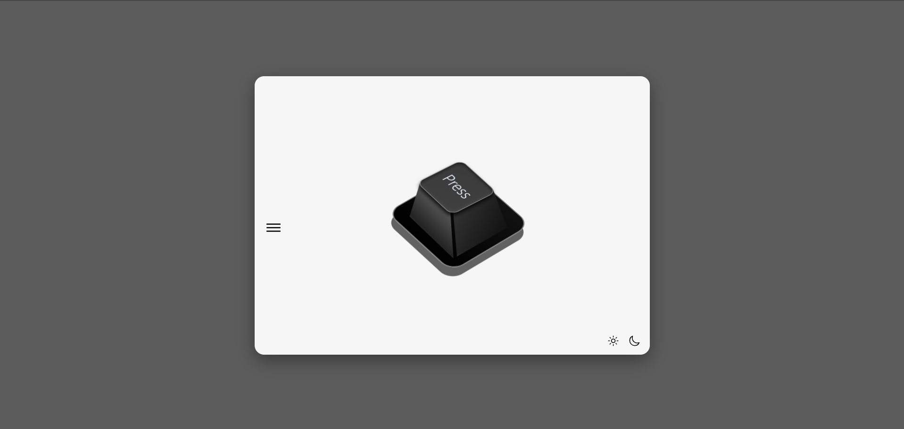

# 🎹 Interactive 3D Keyboard Key Animation

An interactive and visually engaging 3D keyboard key built using **HTML**, **CSS**, and **JavaScript** — inspired by [@BalintFerenczy](https://twitter.com/BalintFerenczy)'s amazing post!

## 🚀 Features

- 🧊 3D Key animation with smooth transitions
- 🎧 Realistic key press sound (click effect)
- 🌗 Light & Dark mode toggle
- 🎨 Pure CSS design (no external libraries except Bootstrap for layout)
- 🖱️ Responsive on interaction (`mousedown`, `mouseup`)
- 🎥 Preview image included

## 🖼️ Preview

## Live Demo 
👉 [**Click here to try it live**](https://pressablebtn.netlify.app/) 

## 🛠️ Technologies Used

- **HTML5**
- **CSS3**
- **JavaScript (ES6)**
- **Bootstrap 5 (for layout only)**

## 📂 File Structure

